# Прогнозирование цен на квартиры в Бишкеке

Задача — построить модель оценки стоимости квартиры в Бишкеке (в USD) по характеристикам объявления: площади, числу комнат, состоянию ремонта, серии дома, этажу и геолокации. Работа охватывает полный цикл: очистку «сырых» данных, статистический отбор признаков, сравнение четырёх семейств моделей и подбор гиперпараметров с помощью GridSearch и Optuna.

**Ключевой результат:** ансамблевые модели (Random Forest, CatBoost) достигают MAPE ≈ 0.10, то есть средняя ошибка прогноза составляет около 10% от цены квартиры, что существенно лучше линейных базовых моделей.

---

## Содержание

1. [Данные и предобработка](#1-данные-и-предобработка)
2. [Разведочный анализ и отбор признаков](#2-разведочный-анализ-и-отбор-признаков)
3. [Моделирование](#3-моделирование)
4. [Подбор гиперпараметров](#4-подбор-гиперпараметров)
5. [Сравнение моделей](#5-сравнение-моделей)
6. [Интерпретация: важность признаков](#6-интерпретация-важность-признаков)
7. [Анализ ошибок](#7-анализ-ошибок)
8. [Выводы](#8-выводы)
9. [Воспроизведение](#9-воспроизведение)

---

## 1. Данные и предобработка

Исходные данные — выгрузка объявлений о продаже квартир (`train.csv`). Целевая переменная — `usd_price`.

Очистка данных инкапсулирована в класс `ApartmentPreprocessor`:

| Шаг | Что делает |
|---|---|
| `clean_floor` | Извлекает номер этажа из текста; `цоколь` → 0.5, `подвал` → 0 |
| `clean_area` | Парсит строки вида `«75 м2»` в число |
| `clean_rooms` | Извлекает число комнат; для «свободной планировки» восстанавливает его по площади через пороговые интервалы (20–40 м² → 1 комната, 40–70 → 2 и т.д.) |
| `clean_building_info` | Разделяет поле «Дом» на тип дома и год постройки |
| `drop_unused_columns` | Удаляет колонки с >30% пропусков и служебные поля (`address`, `added`, `upped`, `Тип предложения`) |

Дополнительные шаги:

- **Географическая фильтрация.** Оставлены только объекты внутри границ Бишкека: `lat ∈ (42.7, 43.0)`, `lon ∈ (74.3, 74.8)`. Это отсекает объявления с ошибочными координатами.
- **Разбиение** train/test = 80/20 (`random_state=42`), все преобразования обучаются только на train.
- **Заполнение пропусков** — `IterativeImputer` (MICE): каждая колонка с пропусками моделируется по остальным признакам; imputer обучается на train и применяется к test без утечки данных.

Итоговое признаковое пространство: `Площадь`, `Комнаты`, `Состояние`, `Серия`, `Этаж`, `lat`, `lon`.

## 2. Разведочный анализ и отбор признаков

Перед обучением проверялось, действительно ли категориальные признаки (`Дом`, `Отопление`, `Состояние`, `Серия`) разделяют квартиры на группы с разными ценами.

### 2.1 Распределения цены по категориям

Violin-плоты показывают форму распределения цены внутри каждой категории:

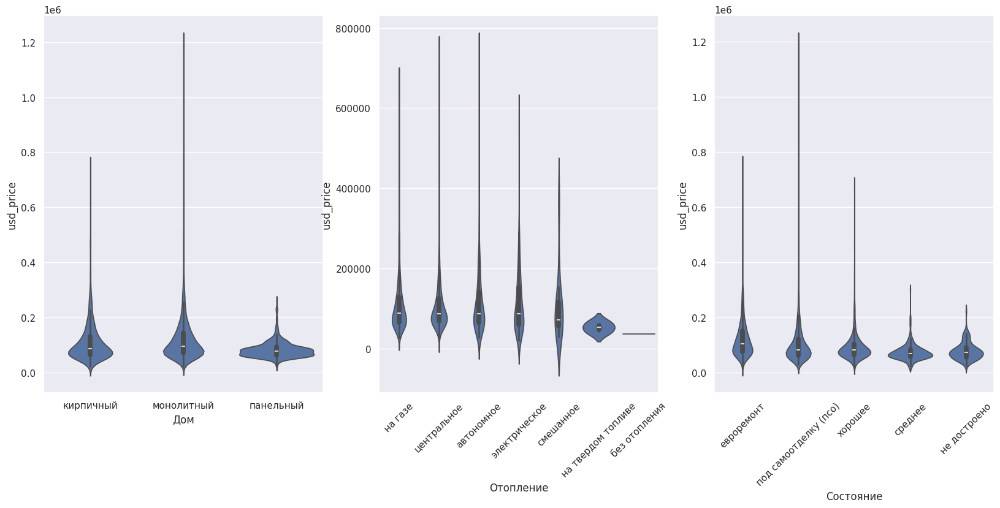

KDE-плоты плотности подтверждают картину: распределения цены для разных типов дома и видов отопления почти полностью перекрываются — категории плохо различимы по цене:

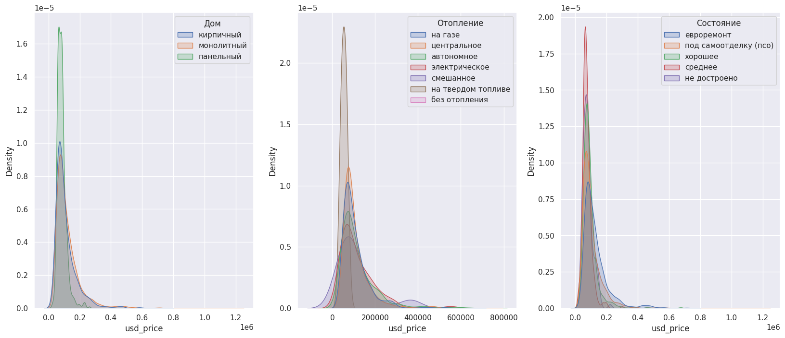

### 2.2 Цена при фиксированной площади

Чтобы исключить влияние площади (главного ценового фактора), построены scatter-плоты «площадь → цена» с раскраской по категориям. Если бы признак был информативен, точки одного цвета лежали бы систематически выше или ниже других:

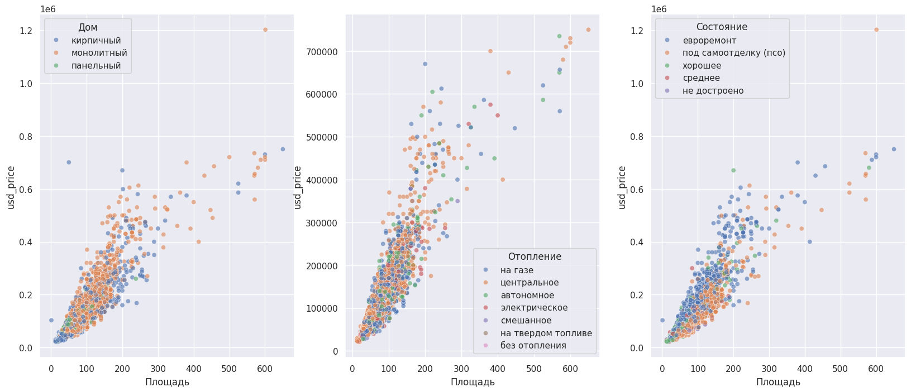

Точки разных категорий перемешаны — при равной площади тип дома и вид отопления почти не сдвигают цену. Исключение — `Состояние`: квартиры с евроремонтом заметно смещены вверх.


**Итог:** признаки `Дом`, `Отопление`, `Год`, `view_count` удалены.

### 2.4 Кодирование категорий

- **`Состояние`** — `OrdinalEncoder` с явным порядком качества:
  `не достроено < под самоотделку (псо) < среднее < хорошее < евроремонт`.
- **`Серия`** — порядковая шкала 1–6, построенная по медианной цене каждой серии. Boxplot ниже обосновывает такой маппинг: серии естественно ранжируются от «малосемейки» до «пентхауса»:

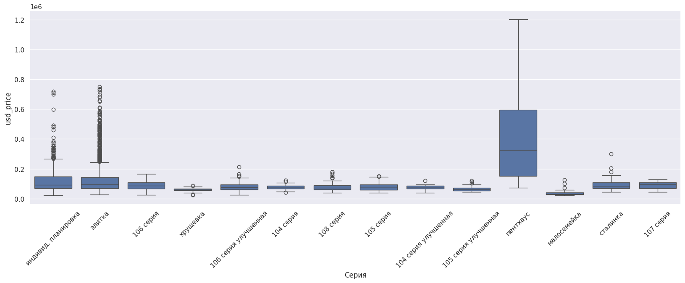

## 3. Моделирование

Обучены четыре семейства моделей (метрика оптимизации — MAPE, как наиболее интерпретируемая для оценки цены):

| Модель | Особенности |
|---|---|
| **Линейная регрессия** (Ridge / Lasso) | `StandardScaler` + регуляризация; подбор `alpha` для Lasso через GridSearchCV; дополнительно — отсечение 5% наблюдений с наибольшими остатками |
| **SGDRegressor** | Huber loss (устойчивость к выбросам); подбор `penalty`, `alpha`, `eta0`, `power_t`, `epsilon` через GridSearchCV; повторное обучение после удаления объектов с ошибкой > $300 000 |
| **Random Forest** | Подбор гиперпараметров сначала GridSearchCV, затем Optuna (100 trials, TPE) |
| **CatBoost** | Нативная работа с категориальными признаками (`Состояние`, `Этаж`, `Комнаты`, `Серия` переданы как категории); loss = RMSE, eval = MAPE; Optuna (100 trials, TPE + MedianPruner, early stopping) |

## 4. Сравнение моделей

Итоговые метрики на тестовой выборке:

| Модель | MAPE ↓ | R² ↑ |
|---|---|---|
| Линейная регрессия (Ridge/Lasso) | *0.17* | *0.83* |
| SGD (Huber) | *0.16* | *0.80* |
| Random Forest (Optuna) | *0.094* | *0.88* |
| **CatBoost (Optuna)** | ***0.092*** | ***0.89*** |


Основные наблюдения:

- Линейные модели упираются в потолок: зависимость цены от площади гетероскедастична (разброс растёт с площадью), а взаимодействия признаков (например, «большая площадь × евроремонт») линейной моделью не улавливаются.
- Huber loss и удаление выбросов улучшают устойчивость SGD, но не меняют картину качественно.
- Ансамбли деревьев дают скачок качества: ошибка падает примерно вдвое по MAPE.
- CatBoost и Random Forest после тюнинга практически эквивалентны.


## 5. SGD. Анализ ошибок

Диагностика остатков (прогноз − факт) SGD модели в зависимости от цены и площади:

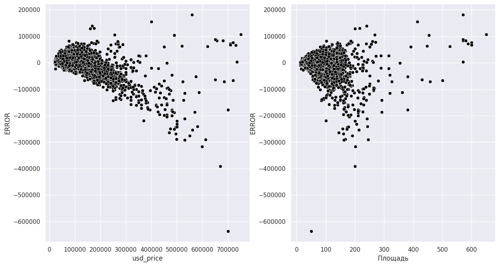

- Для основной массы квартир (до ~$300 000) ошибки симметричны и компактны.
- С ростом цены появляется систематическое **занижение** прогноза (растущее облако отрицательных остатков): дорогих объектов мало, и модель тянет прогноз к «среднему» рынку.
- Аналогичная картина по площади: у объектов >200 м² ошибки крупнее и смещены вниз.

Практический вывод: модель надёжна в массовом сегменте и осторожна в люксовом; для элитной недвижимости прогноз стоит воспринимать как нижнюю оценку.

## 6. Деревяные модели. Подбор гиперпараметров

### 6.1 Динамика поиска Optuna

Сходимость поиска для обеих ансамблевых моделей — уже после ~20 trials MAPE стабилизируется около 0.10, редкие всплески соответствуют неудачным комбинациям параметров:

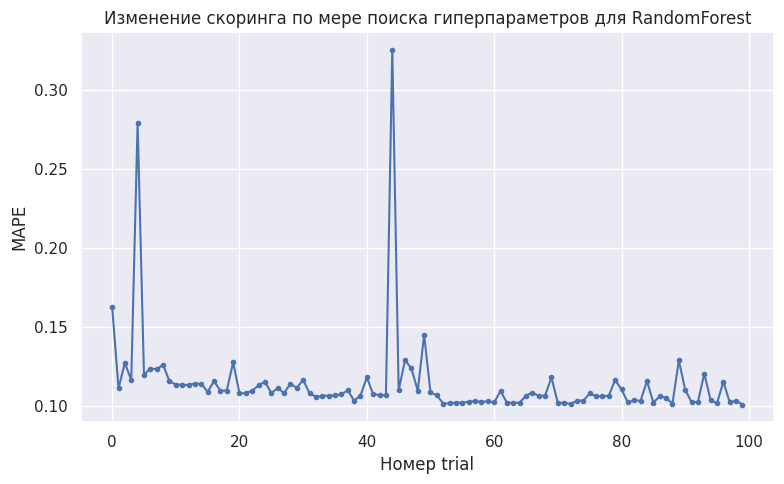

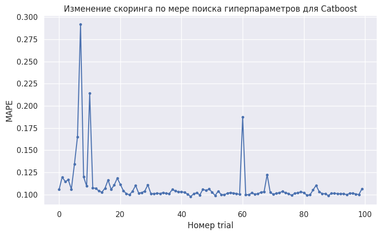

### 6.2 Какие комбинации параметров работают

Parallel coordinate plot для CatBoost: тёмные линии (низкий MAPE) концентрируются на большой глубине (8–10) и умеренном learning rate:

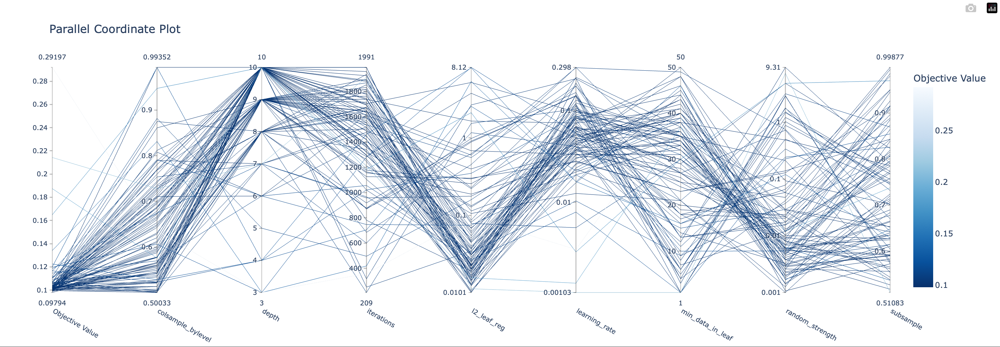

Contour plot пары `depth` × `learning_rate` подтверждает: лучшая зона (тёмно-синяя) — глубокие деревья с learning rate в районе 0.01–0.1; при слишком малом learning rate (< 0.003) качество резко падает, так как итераций не хватает для сходимости:

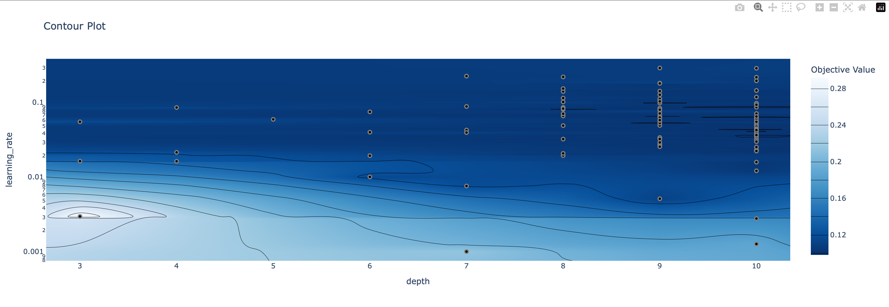

Лучшие параметры Random Forest (Optuna): `n_estimators=443`, `max_depth=21`, `min_samples_split=2`, `min_samples_leaf=1`, `max_features≈0.32`, `bootstrap=False`.


## 7. Интерпретация: важность признаков

Обе ансамблевые модели согласованно ранжируют признаки:

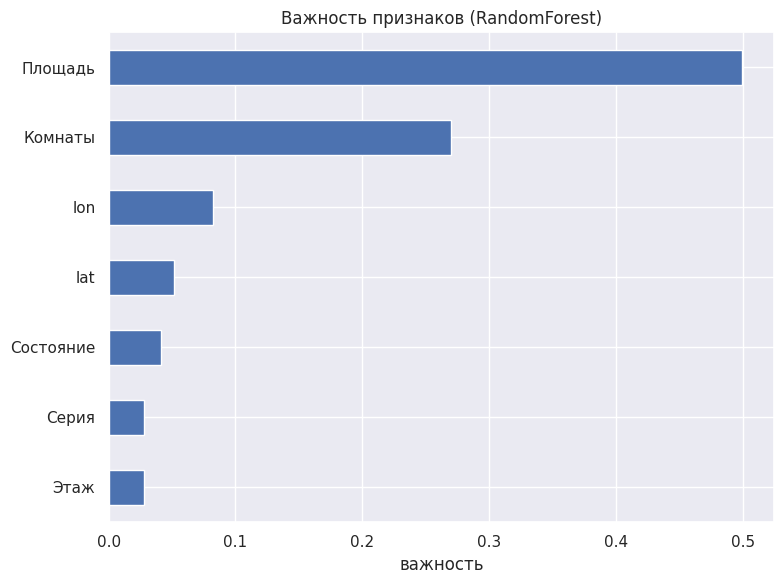

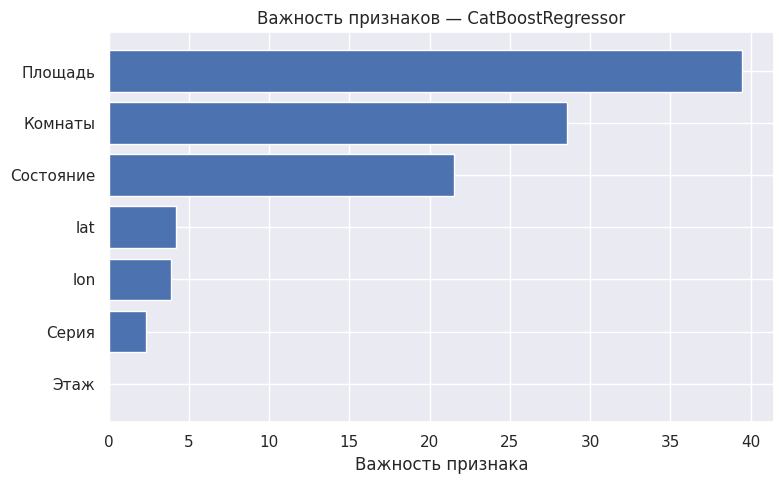

1. **Площадь** — доминирующий фактор (≈50% важности в RF, ≈40 у CatBoost).
2. **Комнаты** — второй по значимости (частично дублирует площадь, но несёт и собственный сигнал о планировке).
3. **Состояние** — CatBoost, работающий с ним как с категорией, извлекает из него заметно больше (≈21%), чем RF из порядкового кода (≈4%). Это согласуется с EDA: состояние — единственная категория, реально сдвигавшая цену при равной площади.
4. **Геолокация** (`lat`, `lon`) и **Серия** — умеренный вклад.
5. **Этаж** — практически незначим.


## 8. Выводы

1. Тщательная предобработка «грязных» текстовых полей (этаж, площадь, комнаты) и географическая фильтрация — обязательный этап: без них ни одна модель не работает адекватно.
2. Статистический отбор признаков позволил увидеть признаки, невлияющие на разделение данных, и упростить модель.
3. Порядковое кодирование `Состояния` и `Серии` по смысловому/ценовому ранжированию работает лучше, чем слепой one-hot.
4. Ансамбли деревьев с тюнингом Optuna достигают **MAPE ≈ 0.09 (R² ≈ 0.88)** — ошибка порядка 9% от цены.
5. Главные ценообразующие факторы: площадь, число комнат и состояние ремонта.
6. Зона роста — дорогой сегмент: возможные направления — лог-трансформация таргета, отдельная модель для люкса, добавление расстояния до центра как признака.

## 9. Воспроизведение

```bash
git clone <url>
cd <repo>
pip install -r requirements.txt
```


### Структура проекта

```
.
├── images/               # Графики исследования
├── README.md
├── main.py               # Предобработка, EDA, обучение и оценка моделей
├── requirements.txt
├── test.csv
└── train.csv

```

### Стек

Python · pandas · NumPy · scikit-learn · SciPy · CatBoost · Optuna · Matplotlib · Seaborn

